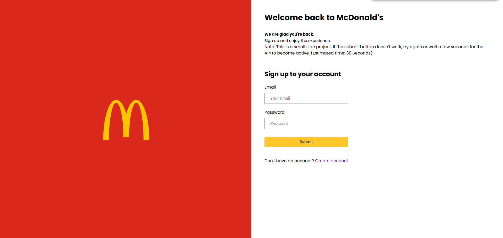

# McDonald's Authentication Side App



Este é um projeto de autenticação desenvolvido com React, TypeScript e Vite, utilizando React Hook Form, Zod, JWT e BCrypt. O objetivo principal é testar e aprimorar habilidades relacionadas à autenticação de usuários em aplicações web.
A API está disponível em: https://github.com/Seila-dev/McDonalds-server e também no swagger https://mcdonalds-server.onrender.com/docs/

## Tecnologias Utilizadas

- **React**: Biblioteca JavaScript para construção de interfaces de usuário.
- **TypeScript**: Superset do JavaScript que adiciona tipagem estática.
- **Vite**: Ferramenta de build e desenvolvimento rápido para aplicações web.
- **React Hook Form**: Biblioteca para gerenciamento de formulários em React.
- **Zod**: Biblioteca para validação de esquemas de dados.
- **JWT (JSON Web Tokens)**: Padrão aberto para criação de tokens de acesso.
- **BCrypt**: Algoritmo de hash seguro para senhas.

## Funcionalidades

- **Cadastro de Usuário**: Permite que novos usuários se registrem fornecendo nome de usuário, e-mail e senha.
- **Login de Usuário**: Usuários existentes podem fazer login utilizando e-mail e senha.
- **Perfil de Usuário**: Após o login, os usuários podem visualizar e editar suas informações pessoais.

## Demonstração

Uma versão ao vivo do projeto está disponível em: [https://mc-donalds-authentication.vercel.app](https://mc-donalds-authentication.vercel.app)

## Instalação

Para rodar o projeto localmente, siga os passos abaixo:

1. Clone o repositório:

   ```bash
   git clone https://github.com/Seila-dev/McDonalds-authentication.git
2. Navegue até o diretório do projeto:
   ```bash
   cd McDonalds-authentication
3. Instale as dependências:
   ```bash
   npm install
4. Inicie o servidor de desenvolvimento:
   ```bash
   npm run dev
   ```
   O aplicativo estará disponível em http://localhost:3000.

## Estrutura do Projeto
A estrutura de diretórios do projeto é a seguinte:
```PGSQL
McDonalds-authentication/
├── node_modules
├── public/
    └── vite.svg     
├── src/
│   ├── assets/           # Arquivos estáticos e imagens
│   ├── components/       # Componentes reutilizáveis da interface
│   ├── contexts/         # Contextos
│   ├── routes/           # Rotas
│   ├── services/         # Funções para interação com APIs e outros serviços
│   ├── styles/           # Arquivos de estilo global
│   └── main.tsx          # Componente principal da aplicação
│   └── vite-env.d.ts     # Tipagem vite
├── eslint.config.js
├── index.html           
├── .gitignore
├── package-lock.json
├── package.json
├── README.md
├── tsconfig.app.json
├── tsconfig.json
├── tsconfig.node.json
├── vercel.json
└── vite.config.ts
```

## Contribuindo

Contribuições são bem-vindas! Para contribuir com este projeto, siga os passos abaixo:

1. Fork o repositório.

2. Crie uma branch para sua feature (git checkout -b feature/nome-da-feature).
3. Faça as alterações desejadas e commit (git commit -am 'Adiciona nova feature').
4. Push para a branch (git push origin feature/nome-da-feature).
5. Abra um Pull Request detalhando as alterações realizadas.

## Contato

Para dúvidas ou sugestões, entre em contato:

    Email: erickoliveira3975@gmail.com
    LinkedIn: https://www.linkedin.com/in/erickrodrigues-dev/